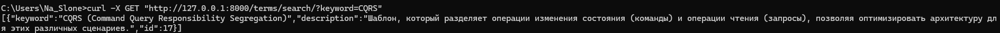
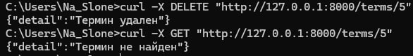

# Лабораторная работа №7. REST. FastAPI. Swagger

## Запуск проекта 

```bash
docker-compose up
```


## Демонстрация

### Swagger


### Получение списка всех терминов.

```
curl -X 'GET' 'http://localhost:8000/terms/'
```


### Получение информации о конкретном термине по ключевому слову.


```
curl -X GET "http://127.0.0.1:8000/terms/search/?keyword=CQRS"
```



### Получение термина по id

```
curl -X GET "http://127.0.0.1:8000/terms/1"
```


### Добавление нового термина с описанием.
```
curl -X POST "http://127.0.0.1:8000/terms/" ^ -H "Content-Type: application/json" ^ -d "{\"keyword\": \"Новый термин\", \"description\": \"Описание нового термина\"}"
```


### Обновление существующего термина.

```
curl -X PUT "http://127.0.0.1:8000/terms/5" ^ -H "Content-Type: application/json" ^ -d "{\"keyword\": \"Обновленный термин\", \"description\": \"Обновленное описание термина\"}"
```


### Удаление термина из глоссария.

``` 
curl -X DELETE "http://127.0.0.1:8000/terms/5"
```


